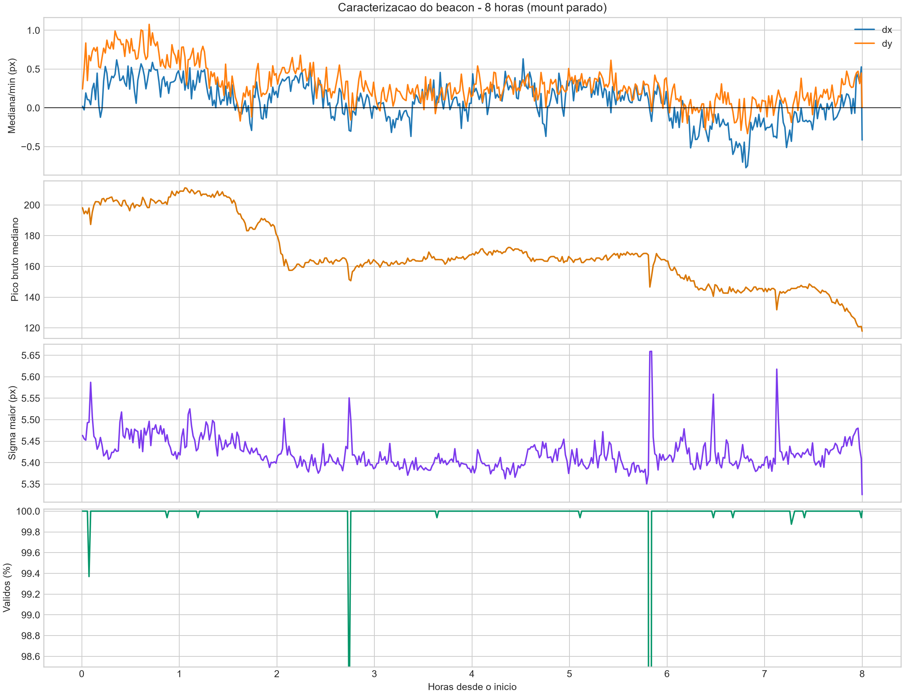
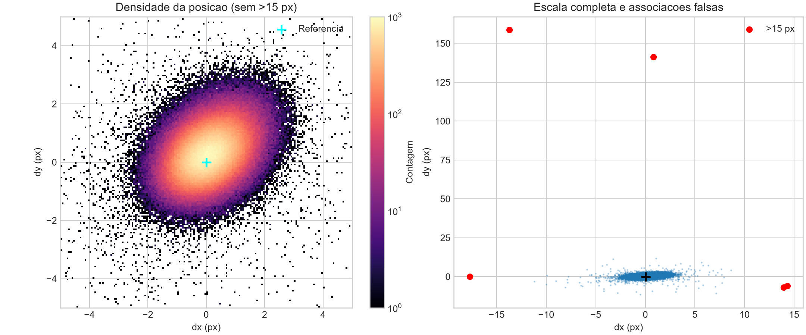
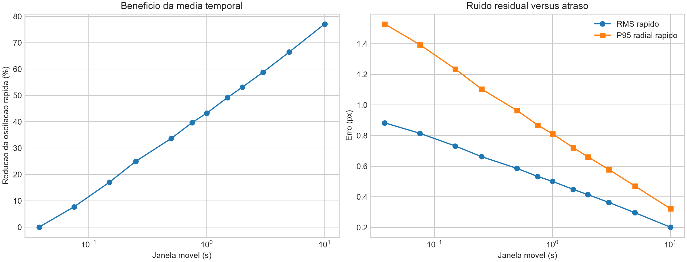
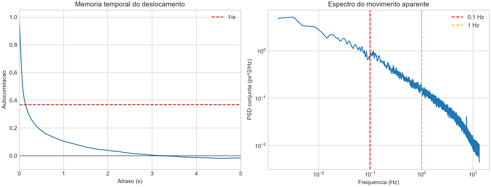
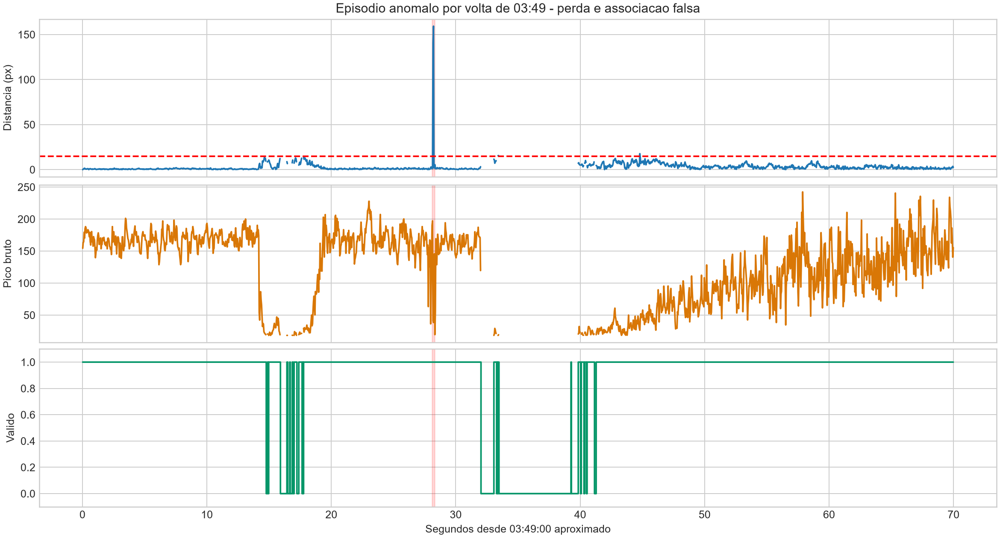

# Relatorio tecnico de estabilidade e rastreamento do beacon

## 1. Objetivo

Este relatorio consolida dois ensaios realizados no enlace optico de
aproximadamente 7 km entre a UFF e o CBPF:

1. **Caracterizacao passiva de 8 h:** camera em aquisicao continua e mount
   desconectado. O objetivo foi medir estabilidade da imagem, variacao temporal
   do beacon, perdas de sinal e desempenho da aquisicao IDS.
2. **Tracking ativo de 1 h 40 min:** mount controlado pelo tracker. O objetivo
   foi manter o centro optico proximo do alvo e registrar as correcoes angulares
   exigidas pelo sistema durante o anoitecer.

Os ensaios medem grandezas diferentes. Na caracterizacao passiva, o movimento
aparece nas coordenadas do beacon na camera. No tracking ativo, parte desse
movimento e removida da imagem e aparece como deslocamento angular acumulado do
mount. Portanto, a posicao do mount nao deve ser interpretada diretamente como
movimento fisico da fonte.

## 2. Resumo executivo

| Resultado | Valor | Significado |
|---|---:|---|
| Duracao passiva | 8 h | Janela continua de observacao sem correcao do mount |
| Frames adquiridos | 761.486 | Total de amostras recebidas da IDS |
| Frames validos | 99,9631% | Frames em que a identidade do beacon foi aceita |
| Erros de captura | 0 | Nao houve falha registrada do SDK ou da camera |
| FPS efetivo | 26,44 Hz | Taxa media realmente processada, nao apenas solicitada |
| Distancia instantanea P95 | 1,909 px | 95% dos centros validos ficaram abaixo desse raio |
| Distancia instantanea P99 | 2,623 px | 99% dos centros validos ficaram abaixo desse raio |
| Media de 2 s dentro de 2 px | 99,726% | Estabilidade apos filtrar a oscilacao rapida |
| Mudanca do primeiro ao ultimo minuto | 0,497 px | Deriva resultante da mediana temporal da imagem |
| Maior perda continua | 5,78 s | Maior intervalo sem identidade valida do beacon |
| Correcao final do mount no ensaio ativo | 41,6 arcsec | Norma da atuacao acumulada em Az/Alt |
| Sinal valido no ensaio ativo | 100% | O tracker nao registrou perda de sinal nessa sessao |

O resultado principal e a coexistencia de duas escalas temporais: a posicao
instantanea oscila devido a turbulencia, forma e intensidade, enquanto a deriva
media pode ser pequena em uma noite e exigir dezenas de arcseconds de correcao
em outra sessao. Isso justifica filtrar a oscilacao rapida e controlar somente
o deslocamento medio persistente.

## 3. Definicao das metricas

| Metrica | Definicao |
|---|---|
| `x_sensor_px`, `y_sensor_px` | Centro de massa da ilha aceita, em pixels do sensor |
| Distancia da referencia | `sqrt((x-x_ref)^2 + (y-y_ref)^2)` |
| Frame valido | Frame em que uma ilha compativel com identidade e posicao esperadas foi aceita |
| P95/P99 | Valor abaixo do qual se encontram 95%/99% das amostras |
| Media movel de 2 s | Centro medio calculado numa janela temporal deslizante; reduz seeing rapido |
| Mediana por minuto | Estimador de tendencia lenta, pouco sensivel a frames isolados |
| Erro do tracker | Distancia entre o centro detectado e o alvo fixado na ROI |
| Deslocamento do mount | Diferenca entre a leitura absoluta atual e a posicao no inicio da sessao |

Pixels descrevem o plano da camera. A conversao para angulo depende da matriz de
calibracao e so e valida enquanto camera, orientacao e optica permanecerem
inalteradas. Deslocamento angular do mount representa a correcao aplicada pelo
sistema, que pode conter deriva geometrica, mudanca do centro optico, efeitos
atmosfericos, acomodacao termica e resposta do controlador.

## 4. Ensaio passivo de 8 h

### 4.1 Configuracao registrada

| Parametro | Valor |
|---|---:|
| Sessao | `beacon_2026-08-25_21-59-27` |
| Inicio | 25/08/2026 21:59:27 |
| Duracao util | 28.800,04 s |
| Exposicao IDS | 12.000 us |
| FPS solicitado | 62,34 fps |
| FPS efetivo | 26,44 Hz |
| ROI efetiva | 516 x 512 px em `(1120, 894)` |
| Threshold da ilha | 25% |
| Referencia no sensor | `(1377,3345; 1149,8304)` px |
| Mount | Desconectado |

Os parametros acima foram lidos de `metadados.json`. A sessao nao foi realizada
com 3.500 us, valor discutido em testes preliminares.

### 4.2 Integridade da aquisicao

| Metrica | Valor | Interpretacao |
|---|---:|---|
| Frames tentados | 761.486 | Cobertura estatistica elevada |
| Frames validos | 761.205 | Identidade aceita em quase toda a sessao |
| Fracao valida | 99,9631% | Apenas 0,0369% ficaram invalidos |
| Erros de captura | 0 | Operacao estavel do backend IDS |
| Intervalo mediano | 37,82 ms | Taxa tipica de aproximadamente 26,4 Hz |
| Intervalo P99 | 38,82 ms | Baixa variacao na entrega dos frames |
| Maior intervalo | 89,26 ms | Pior atraso isolado observado |
| Captura/normalizacao mediana | 25,84 ms | Principal parcela do tempo por frame |

### 4.3 Estabilidade espacial

Cinco frames validos com distancia superior a 15 px foram classificados como
associacoes anomalas e retirados somente das estatisticas de estabilidade
tipica. Os dados originais foram preservados.

| Metrica | Valor | Interpretacao |
|---|---:|---|
| Desvio padrao em X | 0,745 px | Dispersao horizontal instantanea |
| Desvio padrao em Y | 0,702 px | Dispersao vertical instantanea |
| Distancia mediana | 0,807 px | Raio tipico em relacao a referencia |
| Distancia P95 | 1,909 px | 95% dos frames dentro desse raio |
| Distancia P99 | 2,623 px | 99% dos frames dentro desse raio |
| Distancia P99,9 | 4,495 px | Excursao rara, ainda sem incluir outliers grandes |

A mediana calculada a cada minuto percorreu aproximadamente 1,4 px em cada eixo
ao longo da noite. Entre o primeiro e o ultimo minuto, a mudanca foi
`-0,435 px` em X e `-0,240 px` em Y, equivalente a uma norma de `0,497 px`.
Assim, a trajetoria mudou de direcao dentro de uma regiao pequena, mas nao
apresentou deriva monotona expressiva nessa noite.

Usando de forma indicativa a matriz IDS sem rotacao de 19/08/2026, a distancia
mediana, P95 e P99 correspondem aproximadamente a `0,84`, `1,97` e `2,70`
arcsec. Em 7 km, isso equivale geometricamente a cerca de `2,85`, `6,69` e
`9,16 cm` de deslocamento transversal da linha de visada. Essa conversao nao e
uma medida direta de movimento fisico da fonte e depende da validade da matriz.

Graficos relacionados:

- `01_visao_geral_8h.png`: evolucao temporal por minuto;
- `02_densidade_posicao.png`: distribuicao espacial e outliers.

### 4.4 Dinamica temporal e escolha da janela

Depois de remover variacoes mais lentas que 30 s, a autocorrelacao foi:

| Defasagem | Autocorrelacao |
|---:|---:|
| 37,8 ms | 0,70 |
| 75,6 ms | 0,49 |
| Aproximadamente 0,15 s | Cruzamento de `1/e` |
| Aproximadamente 3,18 s | Proxima de zero |

Frames consecutivos nao sao estatisticamente independentes. O aumento de FPS
melhora idade da medida e robustez a oclusoes curtas, mas nao multiplica na
mesma proporcao a quantidade de informacao independente.

| Janela | Frames aproximados | Reducao da oscilacao rapida | Atraso nominal |
|---:|---:|---:|---:|
| 0,5 s | 13 | 34% | 0,25 s |
| 1,0 s | 26 | 43% | 0,49 s |
| 2,0 s | 53 | 53% | 1,00 s |
| 3,0 s | 79 | 59% | 1,49 s |
| 5,0 s | 132 | 66% | 2,50 s |

Com a janela de 2 s, a estimativa media ficou acima de 2 px em apenas 0,274% do
tempo. Aproximadamente 83% da variancia espectral analisada estava acima de
0,1 Hz, faixa que o mount provavelmente nao deve tentar acompanhar. A janela de
2 s foi escolhida como compromisso inicial entre rejeicao da turbulencia e
atraso de controle.

Graficos relacionados:

- `03_janelas_de_media.png`: comparacao das janelas;
- `04_autocorrelacao_psd.png`: memoria temporal e distribuicao espectral.

### 4.5 Intensidade e forma

| Metrica | Primeira hora | Ultima hora | Interpretacao |
|---|---:|---:|---|
| Pico bruto mediano | 201,9 | 140,7 | Reducao de aproximadamente 30% |
| Sigma maior mediano | ~5,4 px | ~5,4 px | Largura permaneceu aproximadamente constante |

Em 0,96% dos frames validos, o pico selecionado foi maior ou igual a 250. Em
0,89% de todos os frames houve pelo menos um pixel igual a 255, concentrado
principalmente nas duas primeiras horas. A exposicao de 12 ms foi adequada para
posicao, mas os dados nao devem ser tratados como radiometria linear devido a
saturacao parcial.

O threshold de 25% produziu exatamente uma ilha em 761.198 frames e duas ilhas
em somente sete. A area mediana foi 375 px, com caixa tipica de 21 x 23 px. Isso
indica que a segmentacao normalmente reuniu o nucleo luminoso de forma estavel.

### 4.6 Perdas e episodio das 03:49

Os 281 frames invalidos formaram 42 intervalos:

| Metrica | Valor |
|---|---:|
| Duracao mediana | 54 ms |
| Percentil 75 | 155 ms |
| Percentil 90 | 313 ms |
| Maior intervalo | 5,78 s |

O episodio mais relevante ocorreu por volta de 03:49:

1. intensidade e forma do beacon mudaram;
2. houve perdas sucessivas da identidade;
3. uma fonte apareceu quase no mesmo X, mas entre 141 e 159 px abaixo;
4. essa fonte foi aceita por dois frames, durante aproximadamente 75 ms;
5. o beacon reapareceu expandido e recuperou intensidade gradualmente.

O comportamento e compativel com oclusao por objeto em movimento. Como a linha
de visada cruza a Baia de Guanabara, uma embarcacao e uma hipotese fisicamente
plausivel: sua estrutura poderia bloquear o beacon enquanto uma luz de
navegacao aparecia abaixo dele. A identificacao nao e conclusiva, pois nao ha
video de campo amplo, registro visual externo ou dados AIS sincronizados.

O maximo de 159,3 px no resumo foi produzido por essa associacao falsa e nao
representa movimento atmosferico do beacon. O evento sustenta o uso de rejeicao
de saltos antes da media, parada sem movimento durante a perda e confirmacao por
varios frames antes de recuperar o controle.

Grafico relacionado: `05_evento_0349.png`.

## 5. Ensaio ativo de 1 h 40 min

### 5.1 Configuracao e desempenho

Fonte dos dados: `Arquivos/Link UFF Final/`.

| Metrica | Valor | Significado |
|---|---:|---|
| Inicio | 19/08/2026 17:53:04 | Sessao durante o anoitecer |
| Duracao | 5.940,9 s (99,0 min) | Tracking continuo |
| Linhas de telemetria | 26.106 | Amostras gravadas no CSV |
| Sinal valido | 100% | Nenhuma perda registrada pelo tracker |
| Loop de medicao | 30,77 Hz | Taxa media de processamento visual |
| Loop de controle | 43,08 Hz | Taxa media da thread de comando |
| Eventos de borda | 0 | A ilha nao tocou a borda da ROI |
| Paradas de seguranca | 0 | Sessao encerrada pelo teclado |

Segundo a memoria operacional do ensaio, nao houve perturbacao manual
intencional nessa sessao final. Como essa informacao nao foi registrada no CSV,
a interpretacao permanece condicionada a essa observacao experimental.

### 5.2 Erro residual na imagem

| Metrica | Valor | Significado |
|---|---:|---|
| Erro mediano | 2,659 px | Desalinhamento residual tipico |
| RMS | 3,246 px | Penaliza mais os erros maiores |
| P90 | 4,890 px | 90% das medidas abaixo desse valor |
| P95 | 5,648 px | 95% das medidas abaixo desse valor |
| Maximo | 21,195 px | Maior perturbacao visual registrada |
| Dentro de 6 px | 96,392% | Fracao dentro da saida da zona de repouso |
| Dentro de 10 px | 99,908% | Fracao sem erro visual elevado |
| Zona de repouso ativa | 99,104% | O mount permaneceu sem comando na maior parte do tempo |

O tracker manteve o beacon proximo do alvo e realizou correcoes ocasionais
quando o erro ultrapassou a histerese. A alta fracao em repouso explica o perfil
em degraus da posicao absoluta do mount.

### 5.3 Correcao acumulada do mount

| Metrica | Azimute | Altitude | Norma 2D |
|---|---:|---:|---:|
| Posicao final menos inicial | -24,0 arcsec | +34,0 arcsec | 41,6 arcsec |
| Ultimos 5 min menos primeiros 5 min | -22,0 arcsec | +26,0 arcsec | 34,1 arcsec |
| Faixa observada | 36,0 arcsec | 43,0 arcsec | Maximo radial: 49,1 arcsec |

A tendencia nao foi apenas um valor final isolado. Depois de aproximadamente
20 min, a correcao mediana ainda evoluiu de cerca de `(-4; +23)` arcsec para
`(-24; +34)` arcsec no fim. Isso mostra demanda de compensacao de baixa
frequencia ao longo da sessao.

Entretanto, a atuacao acumulada nao identifica sozinha a origem da mudanca. O
ensaio atravessou o anoitecer, e o algoritmo antigo corrigia diretamente o CM
instantaneo. Variacoes lentas de intensidade, forma, assimetria, saturacao e
contraste com o fundo podem deslocar o centro optico mesmo com a fonte
geometricamente fixa. Tambem podem contribuir refracao atmosferica, acomodacao
termica, estrutura e mecanica do mount. O resultado deve ser descrito como
**correcao angular exigida para manter o centro optico**, nao como movimento
fisico comprovado da fonte.

Grafico relacionado:
`Arquivos/Link UFF Final/Graficos/05_drift_compensado_pelo_mount.png`.

## 6. Comparacao entre as sessoes

| Aspecto | Caracterizacao passiva de 8 h | Tracking ativo de 1 h 40 min |
|---|---|---|
| Condicao | Noite, mount desconectado | Anoitecer, mount em malha fechada |
| Grandeza principal | Posicao do beacon na camera | Erro residual e posicao do mount |
| Deriva observada | 0,497 px entre inicio e fim | 41,6 arcsec de correcao final |
| Oscilacao rapida | Medida diretamente | Parcialmente convertida em comandos |
| Principal conclusao | Alta estabilidade nessa noite | Necessidade de compensacao lenta em outra sessao |
| Limitacao | Uma unica noite | Causas opticas, ambientais e mecanicas misturadas |

Os resultados nao sao contraditorios. Eles demonstram que as condicoes variam
entre sessoes e que o sistema deve operar em dois regimes:

1. rejeitar oscilacoes rapidas que o mount nao consegue acompanhar;
2. compensar deslocamentos medios persistentes, independentemente de serem
   produzidos por apontamento, atmosfera ou evolucao do centro optico.

## 7. Implicacoes para o novo tracker

Os dados sustentam as seguintes decisoes:

1. **Janela temporal de 2 s:** reduz cerca de 53% da oscilacao rapida com atraso
   nominal de 1 s.
2. **Rejeicao antes da media:** impede que fontes concorrentes, como a do evento
   de 03:49, desloquem o estimador.
3. **Controle mais lento:** os ganhos foram reduzidos para compensar o atraso da
   media e priorizar deriva de baixa frequencia.
4. **Zona de repouso:** evita comandos desnecessarios quando o erro medio e
   pequeno.
5. **Perda de sinal:** o mount deve parar, manter a ultima identidade e aguardar
   recuperacao sem realizar busca cega.
6. **Exposicao adaptativa lenta:** mudancas devem usar somente a ilha travada,
   considerar saturacao externa e permanecer congeladas durante oclusoes.
7. **Telemetria de forma e fundo:** intensidade, area, largura, assimetria,
   exposicao e nivel de fundo sao necessarios para separar deriva geometrica de
   deslocamento do CM causado pela evolucao da imagem.

## 8. Limitacoes

- Os ensaios ocorreram em datas, horarios e configuracoes diferentes.
- A caracterizacao passiva representa uma unica noite e uma unica condicao
  meteorologica.
- A sessao ativa ocorreu durante mudanca acentuada de iluminacao.
- O tracking antigo nao registrava todas as metricas de forma e intensidade.
- A matriz angular da caracterizacao passiva foi associada posteriormente e
  nao estava copiada dentro da sessao.
- O centro de massa da ilha segmentada nao e necessariamente igual ao centro de
  energia relevante para acoplamento em fibra.
- A hipotese de embarcacao no evento das 03:49 e compativel com os dados, mas
  nao confirmada independentemente.

## 9. Proximos ensaios recomendados

1. Repetir caracterizacao passiva durante tarde, anoitecer e noite, mantendo
   exposicao fixa quando o objetivo for comparar intensidade.
2. Registrar CM, pico, intensidade total, area, largura, assimetria, fundo e
   exposicao no mesmo timestamp.
3. Validar o tracker temporal primeiro sem movimento, depois em teste limitado
   e supervisionado.
4. Comparar janelas de 1, 2, 3 e 5 s em condicoes diferentes.
5. Medir FPS real, latencia P95/P99 e idade do frame no tracker com e sem tela.
6. Usar camera de campo amplo ou registro AIS para classificar futuras oclusoes
   sobre a Baia de Guanabara.

## 10. Conclusoes

1. A aquisicao IDS foi tecnicamente estavel durante 8 h, sem erros de captura.
2. Na sessao passiva, 95% dos centros instantaneos ficaram dentro de 1,909 px e
   a media de 2 s ficou dentro de 2 px em 99,726% do tempo.
3. A deriva entre o inicio e o fim dessa noite foi inferior a 0,5 px, mas esse
   resultado nao deve ser generalizado para todos os dias.
4. Em outra sessao, o tracker manteve 100% de sinal e acumulou 41,6 arcsec de
   correcao durante o anoitecer, evidenciando demanda de compensacao lenta.
5. O evento das 03:49 mostrou que oclusoes e fontes concorrentes precisam ser
   rejeitadas antes de qualquer comando ao mount.
6. O controle deve acompanhar a tendencia media do beacon, nao a turbulencia ou
   a redistribuicao luminosa de cada frame.
